# 前言

秒杀系统主要应用在商品抢购的场景，比如：

- 天猫淘宝双十一抢购限量商品
- 小米手机抢购
- 卖热门演唱会的门票
- 火车票抢座
- …

秒杀系统抽象来说就是以下几个步骤：

- 用户选定商品下单
- 校验库存
- 扣库存
- 创建用户订单
- …

所谓“秒杀”,就是网络卖家发布一-些超低价格的商品,.所有买家在同-时间网上抢购的一种销售方式

- 低价，少量库存，疯抢
- 高并发，大流量

## 为什么要做所谓的“系统”

如果你的项目流量非常小，完全不用担心有并发的购买请求，那么做这样一个系统意义不大。

但如果你的系统要像12306那样，接受高并发访问和下单的考验，那么你就需要一套完整的**流程保护措施**，来保证你系统在用户流量高峰期不会被搞挂了。（就像12306刚开始网络售票那几年一样）

这些措施有什么呢：

- 严格防止超卖：库存100件你卖了120件，程序员背锅，战士上战场，这点小事都干不好，等着被辞退吧
- 防止非法请求：防止不怀好意的人群通过各种技术手段以较低的秒杀价格大量下单。
- 保证用户体验：高并发下，别网页打不开了，支付不成功了，购物车进不去了，地址改不了了。系统直接崩溃，体验差的一批。这个问题非常之大，涉及到各种技术，也不是一下子就能讲完的，甚至根本就没法讲完。

#  🔪大纲（技术概要）

- springBoot 单体架构+微服务双版本

- 不仅仅是秒杀，高并发业务场景如何应对
- 技术点（前后端分离(较简单，主要实现优化秒杀)）
    - 前端
        - ~~Thymeleaf~~、layui、 Jquery 、vue
    - 后端
        - SpringBoot、JSR303 服务端验证框架，做服务端参数校验、MyBatis、SpringCloud Alibaba、Dubbo
    - 中间件
        - RabbitMQ  消息队列
        - Redis  缓存
        - Druid  阿里开发连接池，可以监控
    
- 大纲
    - 分布式会话、商品列表页、商品详情页、订单详情页、系统压测、缓存优化
    - 消息队列、接口安全
- 应对大并发
    - 缓存、异步、优雅代码
- 代码错误记录以及解方案
- 常见问题分析

## 目录

[TOC]


- 项目框架搭建
    - SpringBoot环境搭建
    - 集成~~Thymeleaf~~,Result结果封装
    - 集成Mybatis+Druid
    - 集成Jedis+Redis安装+通用Key封装
    
- 登录
    - 数据库设计
    - 明文密码两次MD5+加盐
    - JSR303参数检验+全局异常处理
    - 分布式Session /JWT无状态登录
    
- 后台

- 秒杀功能
    - 数据库设计
    - 商品列表页
    - 商品详情页
    - 订单详情页
    
- JMeter压测
  
    - 模拟多用户
    
- 页面优化
    - 页面缓存、URL缓存、对象缓存
    - 页面静态化，前后端分离
    - 静态资源优化
    - CDN优化
    
- 接口优化
    - Redis预减库存减少数据库访问
    - 内存标记减少Redis访问
    - RabbitMQ队列缓冲，异步下单，增强用户体验
    - 访问Nginx书评拓展
    - 压测
    
- 安全优化
    - 秒杀接口地址隐藏
    - 数学公式验证码(削峰)
    - 接口防刷
    
    ### 热部署
    
    ```xml
    <dependency>
       <groupId>org.springframework.boot</groupId>
       <artifactId>spring-boot-devtools</artifactId>
       <!-- optional=true, 依赖不会传递, 该项目依赖devtools; 之后依赖boot项目的项目如果想要使用devtools, 需要重新引入 -->
       <optional>true</optional>
    </dependency>
    ```
    
    ## 架构图 借鉴https://github.com/qiurunze123/miaosha
    
    
    
    > 未来设计图 : 未来设计 
    
    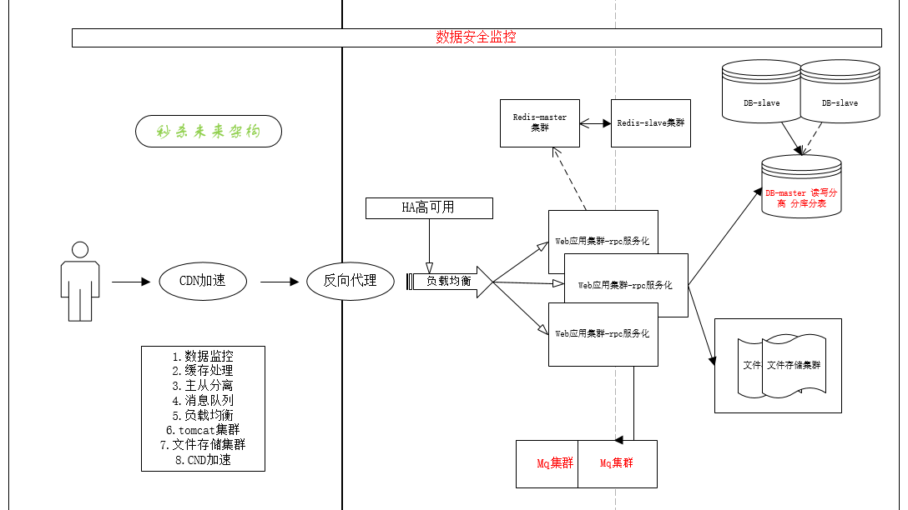
    
    > mysql 数据库表设计
    
    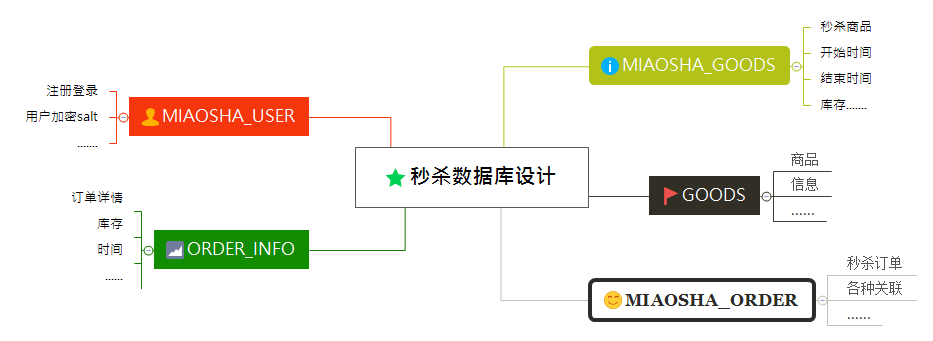
    
    
    
    

# 🐱‍🏍准备工作

## json格式封装 Result.java

```json
{
    "code": 500100,
    "msg": "库存不足",
    "data":{},[]
}
```

```java
public class Result<T> {
    private int code;
    private String msg;
    //不清楚的类型，定义为泛型
    private T data;
    /**
     * 成功时调用
     *
     * @param data 数据
     * @param <T>
     * @return
     */
    public static <T> Result<T> success(T data) {
        return new Result<>(data);
    }
    /**
     * 错误时调用
     *
     * @param cm
     * @param <T>
     * @return
     */
    public static <T> Result<T> error(CodeMsg cm) {
        return new Result<T>(cm);
    }
    //...get set ...
}
```

- 错误码CodeMsg.java

```java
public class CodeMsg {
    private int code;
    private String msg;
    private  CodeMsg(int code, String msg) {
        this.code = code;
        this.msg = msg;
    }
    //通用异常
    public static CodeMsg SUCCESS = new CodeMsg(0,"success");
    public static CodeMsg SERVER_ERROR = new CodeMsg(500100,"服务端异常");
    //登录模块异常 500200
    //商品模块 500300
    //...
}
```

```properties
#设置null的属性值不显示，比如通过json返回User的时候，密码要设置为null
spring.jackson.default-property-inclusion=non_null
```


## ~~thymeleaf(弃用，改用前后端分离)~~

```xml
<dependency>
    <groupId>org.springframework.boot</groupId>
    <artifactId>spring-boot-starter-thymeleaf</artifactId>
</dependency>
```

- 文件配置

    ```properties
    # thymeleaf
    spring.thymeleaf.cache=false
    ```

## mybatis

```xml
<dependency>
    <groupId>org.mybatis.spring.boot</groupId>
    <artifactId>mybatis-spring-boot-starter</artifactId>
    <version>2.1.1</version>
</dependency>
<!--数据库-->
<dependency>
    <groupId>mysql</groupId>
    <artifactId>mysql-connector-java</artifactId>
    <scope>runtime</scope>
</dependency>
```

```properties
# mybatis
# 实体类包路径
mybatis.type-aliases-package=cn.peoplevip.miaosha.domain
#下划线转驼峰
mybatis.configuration.map-underscore-to-camel-case=true
mybatis.configuration.default-fetch-size=100
mybatis.configuration.default-statement-timeout=3000
# 配置文件扫描路径
mybatis.mapper-locations=classpath:cn/peoplevip/miaosha/dao/*.xml
```

## druid

```xml
<!--druid-->
<dependency>
    <groupId>com.alibaba</groupId>
    <artifactId>druid-spring-boot-starter</artifactId>
    <version>1.1.21</version>
</dependency>
```

- 配置文件

```properties
#druid
spring.datasource.type: com.alibaba.druid.pool.DruidDataSource
spring.datasource.url=jdbc:mysql://localhost:3306/miaosha?serverTimezone=UTC&useUnicode=true&characterEncoding=utf-8&useSSL=true
spring.datasource.username=root
spring.datasource.password=root
spring.datasource.driver-class-name=com.mysql.cj.jdbc.Driver
# 初始化大小、最小、最大连接数
spring.datasource.druid.initial-size=3
spring.datasource.druid.min-idle=3
spring.datasource.druid.max-active=10

# 配置获取连接等待超时的时间
spring.datasource.druid.max-wait=60000

# 监控后台账号和密码
spring.datasource.druid.stat-view-servlet.login-username=admin
spring.datasource.druid.stat-view-servlet.login-password=admin
#是否启用StatViewServlet（监控页面）默认值为false
spring.datasource.druid.stat-view-servlet.enabled=false

# 配置 StatFilter
spring.datasource.druid.filter.stat.log-slow-sql=true
spring.datasource.druid.filter.stat.slow-sql-millis=2000
```

## Redis

```xml
<dependency>
    <groupId>redis.clients</groupId>
    <artifactId>jedis</artifactId>
</dependency>

```

### 配置

```properties
# redis
redis.host=127.0.0.1
redis.port=6379
redis.timeout=3
redis.password=
redis.poolMaxTotal=10
redis.poolMaxldle=10
#最大等待
redis.poolMaxWait=3
```

### 配置接收

```java
@Component
@ConfigurationProperties(prefix = "redis")
public class RedisConfig {
    private String host;
    private int port;
    //秒
    private int timeout;
    private String password;
    private int poolMaxTotal;
    private int poolMaxldle;
    private int poolMaxWait;
    //get set
}
```


### 序列化工具

```xml
<dependency>
    <groupId>com.alibaba</groupId>
    <artifactId>fastjson</artifactId>
    <version>1.2.62</version>
</dependency>
<!--或者(谷歌这个序列化工具结果为二进制，性能更高)-->
 <dependency>
     <groupId>com.dyuproject.protostuff</groupId>
     <artifactId>protostuff-core</artifactId>
     <version>1.0.8</version>
</dependency>
<dependency>
    <groupId>com.dyuproject.protostuff</groupId>
    <artifactId>protostuff-runtime</artifactId>
    <version>1.0.8</version>
</dependency>
```

Spring Boot配置注解执行器   当执行类中已经定义了对象和该对象的字段后，在配置文件中对该类赋值时，便会非常方便的弹出提示信息

```xml
<!--配置注解执行器(不配置不影响运行)-->
<dependency>
    <groupId>org.springframework.boot</groupId>
    <artifactId>spring-boot-configuration-processor</artifactId>
    <optional>true</optional>
</dependency>
```

```java
//代码片段
 //原子操作  正常返回ok，错误返回错误信息
return jedis.setex(key, redisConfig.getTimeout() * 1000, str);
//序列化操作类
public class ProtostuffUtil {
    /**
     * 序列化
     */
    public static <T> byte[] serializer(T t){
        Schema schema = RuntimeSchema.getSchema(t.getClass());
        return ProtostuffIOUtil.toByteArray(t,schema,
                LinkedBuffer.allocate(LinkedBuffer.DEFAULT_BUFFER_SIZE));
    }
    /**
     * 反序列化
     */
    public static <T> T deserializer(byte []bytes,Class<T> c) {
        if (bytes == null) {
            return null;
        }
        T t = null;
        try {
            t = c.newInstance();
            Schema schema = RuntimeSchema.getSchema(t.getClass());
            ProtostuffIOUtil.mergeFrom(bytes,t,schema);
        } catch (InstantiationException e) {
            e.printStackTrace();
        } catch (IllegalAccessException e) {
            e.printStackTrace();
        }
        return t;
    }
}
```

### 缓存封装

- 通用封装（模板模式）

    </img>
    
    定义通用前缀类，以此预防存储不会被勿覆盖
    
    定义sevice类 [RedisService](RedisService.md)
    
    这里在配置文件中定义了一个
    
    ```properties
    #redis存储方式是字符还是二进制，参数可选 string、byte
    redis.StorageType=string
    ```
    
    来进行全局使用哪种方法
    
    ```java
    // 在方法上加上注解@PostConstruct，这样方法就会在Bean初始化之后被Spring容器执行（注：Bean初始化包括，实例化Bean，并装配Bean的属性（依赖注入））
    @PostConstruct
    public void init() {
        //true为string方式存储，false为byte[]方式存储
        redisStorage_type = "string".contains(redisConfig.getStorageType());
    }
    这样就不会报空引用了，在Service中调用其他数据时
    ```

# 🐷登录与分布式session/JWT

## 数据库设计

```sql

```


## 密码加密

1. 用户端: PASS = MD5 (明文+固定Salt)
2. 服务端:PASS = MD5 (用户输入+随机Salt)

```java
import org.springframework.util.DigestUtils;
//使用现成的MD5工具，不引入第三方包

//盐，用于混交md5
private static String salt = "asdwqAsd12_qS";
/**
 * 生成md5
 * @param str
 * @return
 */
public static String getMD5(String str) {
    String base = str + "/" + salt;
    String md5 = DigestUtils.md5DigestAsHex(base.getBytes());
    return md5;
}
```


## JSR303参数校验+ 全局异常处理器

- 自定义参数校验(原始方法)

    > 创建校验类，创建参数接受类


### jsr303校验

```xml
<!--引入依赖--> 
<dependency>
      <groupId>org.springframework.boot</groupId>
      <artifactId>spring-boot-starter-validation</artifactId>
</dependency>
```

新增自定义验证器


### 全局异常拦截器

登录时如果密码错误或者无该用户，抛出异常，定义自定义异常拦截器，返回异常信息

```java

/**
全局异常拦截器
 */
@ControllerAdvice
@ResponseBody
public class GlobleExceptionHandler {
    /**
     * 所有异常都拦截
     */
    @ExceptionHandler(value = Exception.class)
    public Result<String> exceptionHandler(HttpServletRequest request, Exception e) {
        //打印异常
        e.printStackTrace();
        //绑定异常
        if (e instanceof GlobleException) {
            GlobleException ex = (GlobleException) e;
            return Result.error(ex.getCodeMsg());

        } else if (e instanceof BindException) {
            BindException ex = (BindException) e;
            List<ObjectError> errors = ex.getAllErrors();
            StringBuilder msg = new StringBuilder(10);
            for (ObjectError error : errors) {
                msg.append(error.getDefaultMessage()).append("\n");
            }
            return Result.error(CodeMsg.BIND_ERROR.fillArgs(msg.toString()));
        } else {
            return Result.error(CodeMsg.SERVER_ERROR);
        }
    }
}

//密码错误异常
throw new GlobleException(CodeMsg.PASSWORD_ERROR);
public class GlobleException extends RuntimeException {
    private static final long serialVersionUID = 1L;
    private CodeMsg codeMsg;
    public GlobleException(CodeMsg codeMsg) {
        super(codeMsg.toString());
        this.codeMsg = codeMsg;
    }
    public static long getSerialVersionUID() {
        return serialVersionUID;
    }
    public CodeMsg getCodeMsg() {
        return codeMsg;
    }
}
```


## 分布式Session和JWT

### 雪花算法(snowflake)唯一UUID

snowflake是Twitter开源的分布式ID生成算法，结果是一个long型的ID。这种方案大致来说是一种以划分命名空间（UUID也算，由于比较常见，所以单独分析）来生成ID的一种算法，这种方案把64-bit分别划分成多段，分开来标示机器、时间等。
其核心思想是：使用41bit作为毫秒数，10bit作为机器的ID（5个bit是数据中心，5个bit的机器ID），12bit作为毫秒内的流水号，最后还有一个符号位，永远是0。

 

整个结构是64位，所以我们在Java中可以使用long来进行存储。 该算法实现基本就是二进制操作,单机每秒内理论上最多可以生成1024*(2^12)，也就是409.6万个ID(1024 X 4096 = 4194304)

>   0 - 0000000000 0000000000 0000000000 0000000000 0 - 00000 - 00000 - 000000000000 
>
>   1位标识，由于long基本类型在Java中是带符号的，最高位是符号位，正数是0，负数是1，所以id一般是正数，最高位是0
>   41位时间截(毫秒级)，注意，41位时间截不是存储当前时间的时间截，而是存储时间截的差值（当前时间截 - 开始时间截) 得到的值），这里的的开始时间截，一般是我们的id生成器开始使用的时间，由我们程序来指定的（如下下面程序IdWorker类的startTime属性）。41位的时间截，可以使用69年，年T = (1L << 41) / (1000L * 60 * 60 * 24 * 365) = 69
>   10位的数据机器位，可以部署在1024个节点，包括5位datacenterId和5位workerId。10-bit机器可以分别表示1024台机器。如果我们对IDC划分有需求，还可以将10-bit分5-bit给IDC，分5-bit给工作机器。这样就可以表示32个IDC，每个IDC下可以有32台机器，可以根据自身需求定义。
>  12位序列，毫秒内的计数，12位的计数顺序号支持每个节点每毫秒(同一机器，同一时间截)产生4096个ID序号。12个自增序列号可以表示2^12个ID，理论上snowflake方案的QPS约为409.6w/s，这种分配方式可以保证在任何一个IDC的任何一台机器在任意毫秒内生成的ID都是不同的。
>  加起来刚好64位，为一个Long型。

**优点：**
整体上按照时间自增排序，并且整个分布式系统内不会产生ID碰撞(由数据中心ID和机器ID作区分)，并且效率较高，经测试，SnowFlake每秒能够产生26万ID左右。

> 毫秒数在高位，自增序列在低位，整个ID都是趋势递增的。
> 不依赖数据库等第三方系统，以服务的方式部署，稳定性更高，生成ID的性能也是非常高的。
> 可以根据自身业务特性分配bit位，非常灵活。

**缺点：**

> 强依赖机器时钟，如果机器上时钟回拨，会导致发号重复或者服务会处于不可用状态。
> 针对此，美团做出了改进：https://github.com/Meituan-Dianping/Leaf

### 类拦截器获取User

```java
@Service
public class UserArgumentResolver implements HandlerMethodArgumentResolver {
      @Autowired
    MiaoshaUserService userService;
    @Override
    public boolean supportsParameter(MethodParameter methodParameter) {
        Class<?> clazz = methodParameter.getParameterType();
        return clazz == MiaoshaUser.class;
    }
    /** 提前拦截请求，并把token转化为类对象*/
    @Override
    public Object resolveArgument(MethodParameter methodParameter, ModelAndViewContainer modelAndViewContainer,
                                  NativeWebRequest nativeWebRequest,
                                  WebDataBinderFactory webDataBinderFactory) throws Exception {
        HttpServletResponse response = nativeWebRequest.getNativeResponse(HttpServletResponse.class);
        HttpServletRequest request = nativeWebRequest.getNativeRequest(HttpServletRequest.class);

        //从请求参数中取出数据,例如表单
        String ParamToken = request.getParameter(MiaoshaUserService.COOKI_NAME_TOKEN);
        //从cookie中取出数据
        String cookieToken = getCookieValue(request, MiaoshaUserService.COOKI_NAME_TOKEN);
        //从header中取出数据
        String headerToken = request.getHeader(MiaoshaUserService.COOKI_NAME_TOKEN);

        if (StringUtils.isEmpty(cookieToken) && StringUtils.isEmpty(ParamToken) && StringUtils.isEmpty(headerToken)) {
            return null;
        }
        //优先级 header > cookies > 参数
        String token = StringUtils.isEmpty(headerToken) ? cookieToken : headerToken;
        if (StringUtils.isEmpty(token)){
            token = ParamToken;
        }
        //取出cookie，依赖token来获取登录状态
        MiaoshaUser user = userService.getByToken(token,response);
        return user;
    }

    private String getCookieValue(HttpServletRequest request, String cookiNameToken) {
        Cookie[] cookies = request.getCookies();
        for (Cookie cookie: cookies){
            if (cookie.getName().equals(cookiNameToken)){
                return cookie.getValue();
            }
        }
        return null;
    }
}

//上方获取的请求数据User可以直接使用,这样就不用每个需要获取User的控制器重新写一遍重复代码
 @GetMapping("/to_list")
public String goods(Model model,MiaoshaUser user) {
    if (user == null) {
        return "redirect:/login";
    }
    model.addAttribute("user", user);
    return "goods_list";
}
```

### 分布式session和JWT比较

#### 什么是session

首先聊聊session和cookie，session对象存储在服务器端节点内存中，cookie存储在客户端浏览器中。一般是客户端请求服务器，服务器端生成session对象，将session对象存储在jvm内存中，并且在响应头中放入sessionId响应给客户端，客户端收到响应后，将sessionid存储在本地。当浏览器第二次请求时会将本地cookie中存储的seesionId通过请求头的方式传递给服务器，这样服务器和客户端就能保持会话信息。

那么为什么会出现分布式session问题呢，为了提高服务器端的负载能力，后台一般将服务器节点做集群，通过ngnix通过轮询的方式转发到目标服务器。打个比方，当浏览器首次访问A服务器生成session对象，然后在访问生成的session对象，如果正好被ngnix转发到了A服务器，那么没问题可以获取到session对象，如果不巧请求被转发到B服务器，由于之前生成的session对象在A服务器，B服务器根本没有生成session对象，很自然访问不到session对象。

知道了问题的存在，那么我们如何解决了，可以通过token令牌代替session解决，或者采用spring-session解决，这里我们选择后一种方式，其实解决思路都是一样的。分布式session不能共享是由于session对象存储在jvm内存中，那么如果共享，答案是将session放入redis中存在，这样不管有多少台应用服务器节点，都能共享redis中存储的session对象

这里采用的分布式session解决方案就是redis保存数据，下边是一些代码、

```java
//首先是登陆问题，请求参数转化为LoginVo对象
//将请求与LoginVo传入miaoshaUserService的login中进行处理，这里直接返回成功，因为如果登录失败会在login中提前返回失败信息
@PostMapping("/tologin")
@ResponseBody
public Result<Boolean> login(@Valid LoginVo loginVo, HttpServletResponse response) {
    log.info(loginVo.toString());
    String verifyCode = loginVo.getVerifyCodeActual();
    //登录,登陆中的错误在server中处理完毕，返回值无用
    miaoshaUserService.login(response,loginVo);
    return Result.success(true);
}
```

上边用到的一些自定义类👇
```java
//LoginVo包含基本的一些信息
public class LoginVo {
    @NotEmpty
    @Digits(integer = 11, fraction = 0)
    private String username;

    @NotEmpty
    @Length(min = 32,max = 32)
    private String password;

    //验证码
    @NotEmpty
    private String verifyCodeActual;
    ...
}
```

login会先判断用户是否存在，如果用户不存在就抛出自定义异常`CodeMsg.USER_NOT_EXIST`,紧接着是判断加密结果是否与数据库相匹配，这里用用到另一个异常`CodeMsg.PASSWORD_ERROR`，[这里是异常拦截器的代码](id=全局异常拦截器)
```java
public boolean login(HttpServletResponse response, LoginVo loginVo) {
        if (loginVo == null) {
            throw new GlobleException(CodeMsg.SERVER_ERROR);
        }
        String username = loginVo.getUsername();
        String password = loginVo.getPassword();
        //验证用户是否存在
        MiaoshaUser miaoshaUser = getById(Long.parseLong(username));
        if (miaoshaUser == null) {
            throw new GlobleException(CodeMsg.USER_NOT_EXIST);
        }
        //验证密码
        String dbPass = miaoshaUser.getPassword();
        String dbSlat = miaoshaUser.getSalt();
        String calcPass = MD5Util.FormPassToDBPass(password, dbSlat);
        if (!calcPass.equals(dbPass)) {
            throw new GlobleException(CodeMsg.PASSWORD_ERROR);
        }
        addCookie(miaoshaUser, response);
        return true;
    }
```

会在`addCookie()`里把信息存储在Redis

```java
private void addCookie(MiaoshaUser miaoshaUser, HttpServletResponse response) {
        //如果登陆成功，生成一个cookie
        String token = UUIDUtil.uuid();
        //字符串存储到Redis
        redisService.set(MiaoshaUserKey.token, token, miaoshaUser);
        Cookie cookie = new Cookie(COOKI_NAME_TOKEN, token);
        cookie.setMaxAge(MiaoshaUserKey.token.expireSeconds());
        cookie.setPath("/");
        response.addCookie(cookie);
    }
```

#### JWT

**无状态登录**

`session` 需要在数据库中保持用户及token对应信息，所以叫 **有状态**。

试想一下，如何在数据库中不保持用户状态也可以登录。

第一种方法： **前端直接传 user_id 给服务端**

缺点也特别特别明显，容易被用户篡改成任务 user_id，权限设置形同虚设。不过思路正确，接着往下走。

改进： **对 user_id 进行对称加密**

比上边略微强点，如果说上一种方法是空窗户，这种方法就是糊了纸的窗户。

改进： **对 user_id 不需要加密，只需要进行签名，保证不被篡改**

这便是 jwt 的思想，user_id，加密算法和签名一起存储到客户端，每次请求接口时，服务器判断签名是否一致。

>  作者：shanyue链接：https://juejin.im/post/5b532492e51d455d6825c0cc

#### JWT方式认证的好处

> 1、因为token存储在客户端，服务器只负责解码。这样不需要占用服务器端资源。
> 2、服务器端可以无限扩展，负载均衡器可以将用户传递到任何服务器，服务器都能知道用户信息，因为jwt里面包含了。
> 3、数据安全，因为有签名，防止了篡改，但信息还是透明的，不要放敏感信息。
> 4、放入请求头提交，很好的防止了csrf攻击，

#### JWT方式的坏处

##### 一、token失效问题
JWT方式最大的坏处就是无法主动让token失效，小伙伴们会说token不是有过期时间吗？是的，token本身是有过期时间，但token一旦发出，服务器就无法收回。

>  如：一个jwt的token的失效时间是3天，但我们发现这个token有异常，有可能被人登录，那真实的用户可以修改密码。但是即使修改了密码，那个异常的token还是合法的，因为3天的失效时间未到，我们服务器是没法主动让异常token失效。

##### 二、数据延时，不一致问题

还有个问题就是因为jwt中包含了用户的部分信息，如果这些部分信息修改了，服务器获取的还是以前的jwt中的用户信息，导致数据不一致。

# ⏰秒杀

## 数据库设计

```
处理逻辑  //事务  1.减库存 2.下订单 3.写入秒杀订
```

## 商品详情页

前端使用vue创建公共头部，以及公共页脚

## 订单详情页

- 使用雪花❄算法生成唯一订单ID

# 💣压力测试

## JMeter介绍


- 压测QPS

    - http://127.0.0.1:8080/goods/to_list

    - 定义1000组线程，0秒启动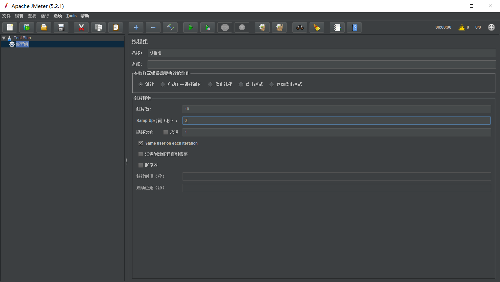

    - 添加默认请求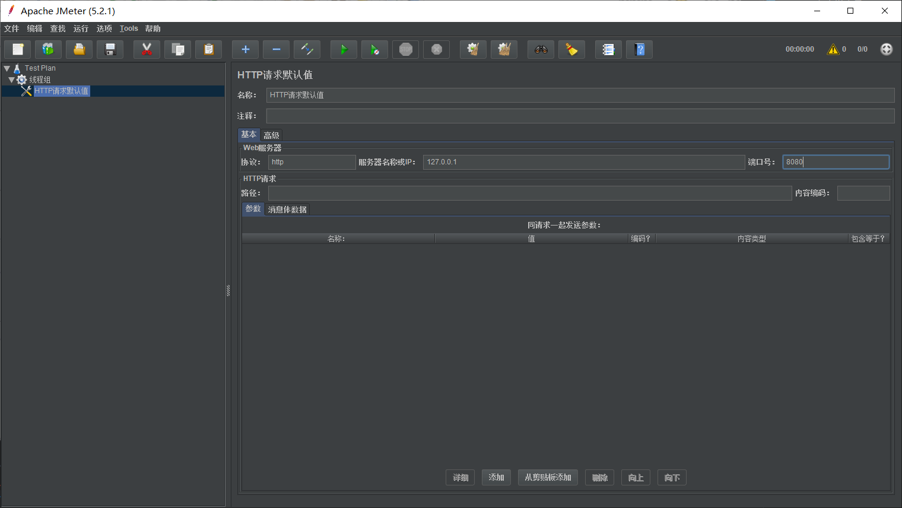

        - 添加(Sampler)取样器为HTTP请求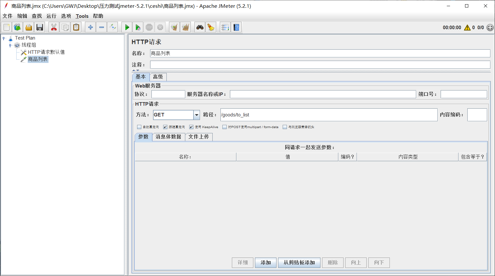

        - 添加聚合报告

        - 添加图形结果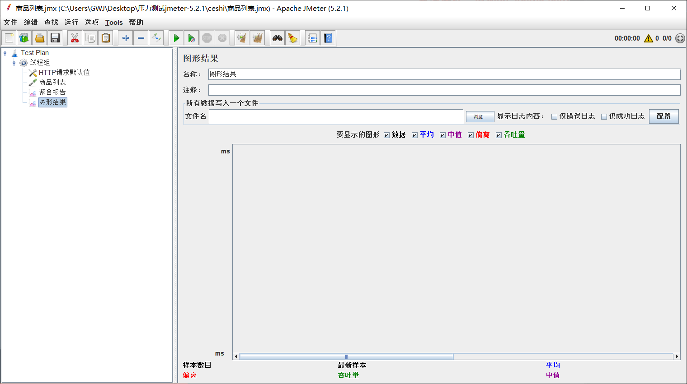

        - 简单结果（QPS=288.5）

            

## 自定义变量模拟多用户

1.测试计划->添加配置元件->CSV Data Set Config
2.引用变量${}

- 创建带token的请求去获取user查询，以此来判断Redis影响QPS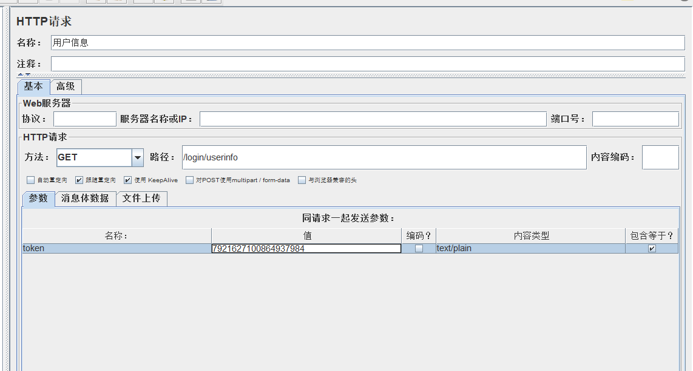

    - 结果QPS达到2241，较之前10倍速度
    - 

- 添加CSV文件设置，用来添加多用户信息

    

    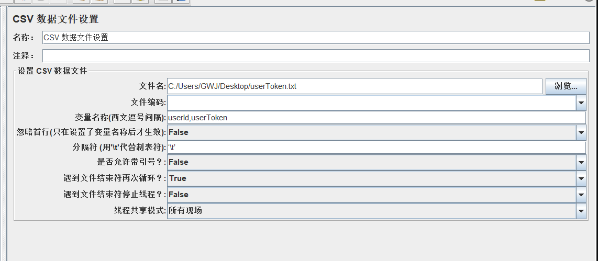

    这里生成了1000个用户，请求4000次 QPS612

    

    并且产生了超卖问题

    

    可以看到商品中为-37

    优化并重新测试，结果:此次未超卖

## JMeter命令行

- 在windows.上录好jmx
- 命令行: `sh jmeter.sh -n -t XXX.jmx -I result.jtl`
- 把result.jtl导入到jmeter

## Redis压测工具redis-benchmark

Redis压测
1. `redis-benchmark -h 127.0.0.1 -p 6379 -c 100 -n 100000`
100个并发连接，1 00000个请求
2. `redis-benchmark -h 127.0.0.1 -p 6379 -q -d 100`
存取大小为100字节的数据包

## mysql性能测试

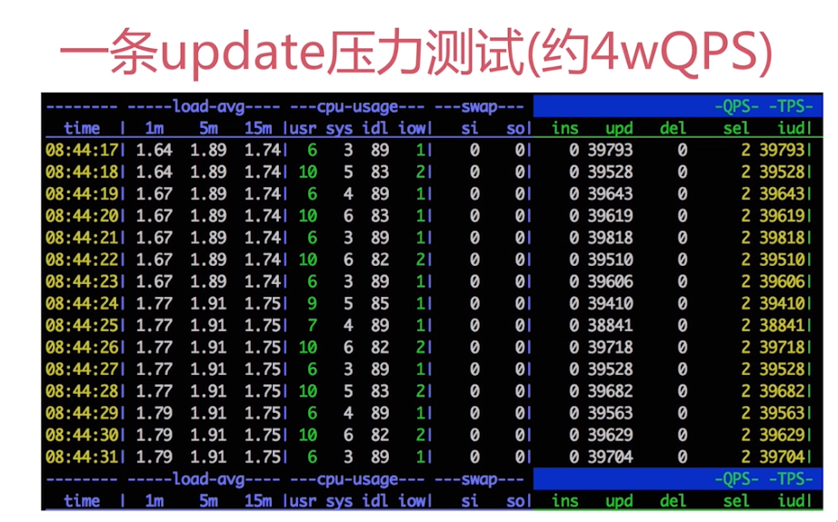


# 🌖完善优化系统

## 页面优化

### 页面缓存、URL缓存、对象缓存

- 页面缓存是将页面缓存到Redis，时间1分钟，我对这种做法无感，观感上不如页面静态化

- 对象缓存

    添加User Redis缓存，只要User未发生变化，希望永久有效

    对原来的获取userInfo接口进行压测

    关于Redis压测连接超时问题

    1. 搭建压力测试环境，模拟现网压力，同样出现了redis建立连接失败，异常显示socket connection timeout

    2. 尝试修改连接池配置，将idl调成和total一致，均为200，问题并未解决。
    3. 尝试加大连接池数量，问题并未解决
    4. redis服务器是单线程的，即同一时刻，仅处理一个连接发出的指令，那么连接池中的多个连接，虽然将指令发送至redis，但redis并未立即处理，而是在排队。那么，与其将指令发送给redis，在redis端排队，不如在本进程内排队，暂不将指令发送至redis，即将redis连接池idl/total均设为1，仅维持一条与redis的连接，如果业务量过大，本进程内排队超时，也就是等待从连接池获取连接超时，那么可以通过加大连接池的maxwait值来解决。想到此点之后，将连接池idl/total调整为1，开始压力测试，未再出现连接建立超时
    5. 经验：redis服务器是单线程模型，加大连接池，只是加大排队的队列数，但是，redis是多进程共用，压力较大，在处理大量的redis指令的同时，还要维护大量的连接，是很耗资源的。所以，每个进程仅维持一条与redis的连接，通过加大maxwait，来控制在本进程内排队，可以降低redis的压力。redis和mysql等不同，mysql是可以多个连接的指令并行执行的，所以连接池设置过大没有意义

### 页面静态化，前后端分离

前后端分离前端页面可以使用Vue，这样可以更好的处理后端参数

这里使用vue的一个前端框架 `ElementUI`，前端项目使用nodejs(nginx)，后端项目使用springboot，

- 前端地址

    http://localhost:8081/

- 后端地址

    http://localhost:8080/

直接请求会产生跨域问题(可以使用nginx反向代理解决)

> 跨域：指的是浏览器不能执行其他网站的脚本。它是由浏览器的同源策略造成的，是浏览器对javascript施加的安全限制

这里需要后端支持`CORS`跨域请求

配置如下，这里我在配置文件中配置了前端地址，后端可以这样获取

```java
 //前端地址
@Value("${frontEndHost}")
String frontHost;
```

在`cn.peoplevip.miaosha.config`下的`WebConfig.java`文件中书写以下代码

```java
@Configuration
public class WebConfig implements WebMvcConfigurer {
    @Override
    public void addCorsMappings(CorsRegistry registry) {
        registry.addMapping("/**")
                .allowedMethods("GET", "POST", "PUT", "DELETE", "OPTIONS")
                .allowedOrigins(frontHost);
    }
}
```

### 静态资源优化

1. JS/CSS 压缩，减少流量
2. 多个JS/CSS组合，减少连接数

### CDN优化

1. 上传到GitHub，当作CDN
2. 采用前端CDN(内容分发网络)

## 接口优化

异步下单

### Redis预减库存减少数据库访问

- 解决超卖

    1. 数据库加唯一索引:防止用户重复购买

        >  sql 使用`ignore`关键字防止数据库报错
        >
        > ```
        > INSERT IGNORE INTO
        > ```
        >
        > ignore关键字所修饰的SQL语句执行后，在遇到主键冲突时会返回一个0，代表并没有插入此条数据。如果主键是由后台生成的（如uuid），我们可以通过判断这个返回值是否为0来判断主键是否有冲突，从而重新生成新的主键ke

    2. SQL加库存数量判断:防止库存变成负数

- 思路：减少数据库访问

    1. 系统初始化，把商品库存数量加载到Redis
    2. 收到请求，Redis预减库存，库存不足,直接返回,否则进入3
    3. 请求入队,立即返回排队中
    4. 请求出队,生成订单,减少库存
    5. 客户端轮询,是否秒杀成功


### 内存标记减少Redis访问

设置一个Map，用于存储是否秒杀完毕，秒杀完毕后不进行Redis请求

### 请求先入队缓冲,异步下单,增强用户体验

```java
@RabbitListener(queues = MQConfig.MIAOSHA_QUEUE)
public void receive(String message) {
    log.info("receive message:" + message);
    MiaoshaMessage mm = RedisService.strToBean(message, MiaoshaMessage.class);
    MiaoshaUser user = mm.getUser();
    long goodsId = mm.getGoodsId();

    GoodsVo goods = goodsService.getGoodsVoByGoodsId(goodsId);
    if (goods == null) {
        return;
    }
    int stock = goods.getStockCount();
    //判断库存
    if (stock <= 0) {
        return;
    }
    //判断是否已经秒杀到了
    MiaoshaOrder miaoshaOrder = orderService.getMiaoshaOrderByUserIdGoodsId(user.getId(), goodsId);
    if (miaoshaOrder != null) {
        //已经秒杀过
        return;
    }
    //事务  1.减库存 2.下订单 3.写入秒杀订单
    OrderInfo orderInfo = miaoshaService.miaosha(user, goods);
}
```


### RabbitMQ安装与Spring Boot集成

最为常见的削峰方案是使用消息队列，通过把同步的直接调用转换成异步的间接推送缓冲瞬时流量。除了消息队列，类似的排队方案还有很多，例如：

1. 线程池加锁等待
2. 本地内存蓄洪等待
3. 本地文件序列化写，再顺序读

排队方式的弊端也是显而易见的，主要有两点：

1. 请求积压。流量高峰如果长时间持续，达到了队列的水位上限，队列同样会被压垮，这样虽然保护了下游系统，但是和请求直接丢弃也没多大区别
2. 用户体验。异步推送的实时性和有序性自然是比不上同步调用的，由此可能出现请求先发后至的情况，影响部分敏感用户的购物体验

排队本质是在业务层将一步操作转变成两步操作，从而起到缓冲的作用，但鉴于此种方式的弊端，最终还是要基于业务量级和秒杀场景做出妥协和平衡。

[参考链接](https://segmentfault.com/a/1190000020970562#item-5-12)

以下为RabbitMq集成

- 集成RabbitMQ

rabbitMQ是一个在AMQP协议标准基础上完整的，可服用的企业消息系统。它遵循Mozilla Public License开源协议，采用 Erlang 实现的工业级的消息队列(MQ)服务器，Rabbit MQ 是建立在Erlang OTP平台上[RabbitMQ入门及其几种工作模式](./RabbitMQ入门及其几种工作模式.md)

> 安装教程  https://blog.csdn.net/zhm3023/article/details/82217222
>
> 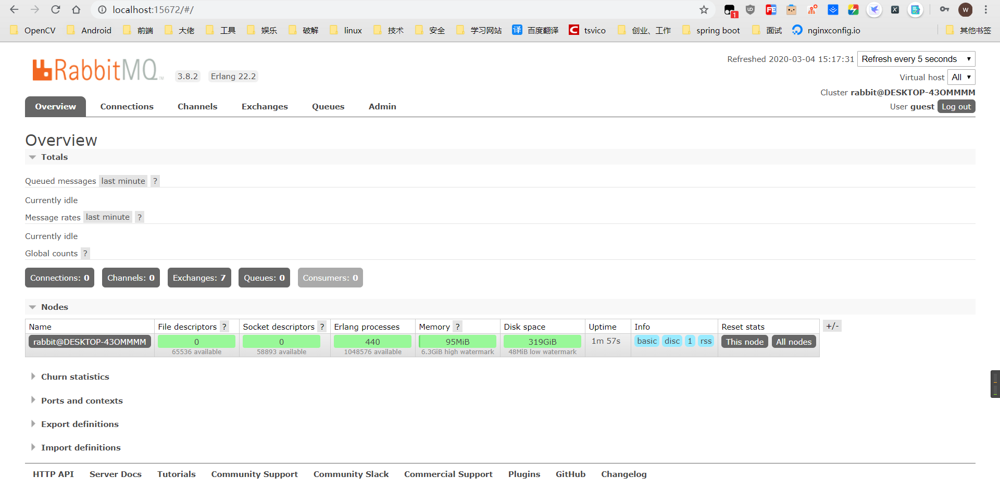
>
> 

1. 添加依赖spring-boot-starter-amqp

    ```xml
    <dependency>
        <groupId>org.springframework.boot</groupId>
        <artifactId>spring-boot-starter-amqp</artifactId>
    </dependency>
    ```

    

2. 创建消息接受者

3. 创建消息发送者

    > 消息接收者执行秒杀

### Nginx水平扩展

反向代理

### 压测

增加消息队列，内存标记后进行压测


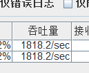

## 安全优化

### 秒杀接口地址隐藏

- 思路：秒杀开始之前，先去请求接口获取秒杀地址

    1. 接口改造，带上PathVariable参数

    2. 添加生成地址接口

    3. 秒杀收到请求，先验证PathVariable

        ```java
         public boolean checkPath(MiaoshaUser user, long goodsId, String path) {
                if (user == null || path == null) {
                    return false;
                }
                String pathOld = redisService.get(MiaoshaKey.getMiaoshaPath, user.getId() + "_" + goodsId, String.class);
                return path.equals(pathOld);
            }
        
            public String createMiaoshaPath(MiaoshaUser user, long goodsId) {
                String hash = MD5Util.getMD5(UUIDUtil.uuid() + "");
                redisService.set(MiaoshaKey.getMiaoshaPath, user.getId() + "_" + goodsId, hash);
                return hash;
            }
        ```

        

### 数学公式验证码

验证码利于将并发削减 

> 思路:点击秒杀之前,先输入验证码，分散用户的请求
>
> 通过提升购买的复杂度，达到两个目的：
>
> 1. 防止作弊。早期秒杀器比较猖獗，存在恶意买家或竞争对手使用秒杀器扫货的情况，商家没有达到营销的目的，所以增加答题来进行限制
> 2. 延缓请求。零点流量的起效时间是毫秒级的，答题可以人为拉长峰值下单的时长，由之前的 <1s 延长到 <10s。这个时间对于服务端非常重要，会大大减轻高峰期并发压力；另外，由于请求具有先后顺序，答题后置的请求到来时可能已经没有库存了，因此根本无法下单，此阶段落到数据层真正的写也就非常有限了

1. 添加生成验证码的接口
2. 在获取秒杀路径的时候,验证验证码
3. ScriptEngine使用(使用JS计算表达式)

使用Kaptcha来生成验证码

验证码返回两种形式 

1. 直接返回图片

```java
BufferedImage image = kaptchaService.createVerifyCode(user,goodsId);
        try(OutputStream out = response.getOutputStream()){
            ImageIO.write(image, "jpg", out);
        }
```

2. 返回base64格式字符串

```java
 BufferedImage image = kaptchaService.createVerifyCode(user,goodsId);
        //try(ByteArrayOutputStream outputStream = new ByteArrayOutputStream()){
//            ImageIO.write(image, "jpg", outputStream);
//            // 对字节数组Base64编码
////            BASE64Encoder encoder = new BASE64Encoder();
////            encoder.encode(outputStream.toByteArray());
////            HashMap<String,String> map = new HashMap<>();
////            map.put("img", encoder.encode(outputStream.toByteArray()));
```


### 接口的限流

限制某一接口单用户访问次数

>  思路:对接口做限流，将访问次数放入缓存中，并对缓存设置有效期

 希望实现效果，在接口上声明注解

```java
@AccessLimit(seconds=5, maxCount=5, needLogin=true)

//写一个注解
@Retention(RUNTIME)
@Target(METHOD)
public @interface AccessLimit {
    int seconds();
    int maxCount();
    boolean needLogin() default true;

}
//写一个拦截器拦截有该注解的请求
@Service
public class AccessInterceptor extends HandlerInterceptorAdapter {

    @Autowired
    MiaoshaUserService userService;

    @Autowired
    RedisService redisService;

    @Override
    public boolean preHandle(HttpServletRequest request, HttpServletResponse response, Object handler)
            throws Exception {
        if (handler instanceof HandlerMethod) {
            MiaoshaUser user = getUser(request, response);
            UserContext.setUser(user);
            HandlerMethod hm = (HandlerMethod) handler;
            //拿到注解
            AccessLimit accessLimit = hm.getMethodAnnotation(AccessLimit.class);
            if (accessLimit == null) {
                return true;
            }

            int seconds = accessLimit.seconds();
            int maxCount = accessLimit.maxCount();
            boolean needLogin = accessLimit.needLogin();
            String key = request.getRequestURI();
            if (needLogin) {
                if (user == null) {
                    render(response, CodeMsg.USER_NOT_LOGIN);
                    return false;
                }
                key += "_" + user.getId();
            }

            AccessKey ak = AccessKey.withExpire(seconds);
            Integer count = redisService.get(ak, key, Integer.class);
            if(count  == null) {
                redisService.set(ak, key, 1);
            }else if(count < maxCount) {
                redisService.incr(ak, key);
            }else {
                render(response, CodeMsg.ACCESS_LIMIT_REACHED);
                return false;
            }
        }
        return true;
    }

    private void render(HttpServletResponse response, CodeMsg userNotLogin) throws Exception {
        OutputStream out = response.getOutputStream();
        String str = JSON.toJSONString(userNotLogin);
        out.write(str.getBytes(StandardCharsets.UTF_8));
        out.flush();
        out.close();
    }

    private MiaoshaUser getUser(HttpServletRequest request, HttpServletResponse response) {

        String ParamToken = request.getParameter(MiaoshaUserService.COOKI_NAME_TOKEN);
        String cookieToken = getCookieValue(request, MiaoshaUserService.COOKI_NAME_TOKEN);

        if (StringUtils.isEmpty(cookieToken) && StringUtils.isEmpty(ParamToken)) {
            return null;
        }
        String token = StringUtils.isEmpty(ParamToken) ? cookieToken : ParamToken;
        //取出cookie，依赖token来获取登录状态
        MiaoshaUser user = userService.getByToken(token, response);
        return user;
    }

    private String getCookieValue(HttpServletRequest request, String cookiNameToken) {
        Cookie[] cookies = request.getCookies();
        if (cookies == null || cookies.length <= 0) {
            return null;
        }
        for (Cookie cookie : cookies) {
            if (cookie.getName().equals(cookiNameToken)) {
                return cookie.getValue();
            }
        }
        return null;
    }
}

//在WebConfig中配置

```

## 接入Swagger2

- 添加依赖

```xml
<properties>
        <swagger2.version>2.9.2</swagger2.version>
</properties>
 <!--Swagger-UI API文档生产工具-->
<dependency>
    <groupId>io.springfox</groupId>
    <artifactId>springfox-swagger2</artifactId>
    <version>${swagger2.version}</version>
</dependency>
<dependency>
    <groupId>io.springfox</groupId>
    <artifactId>springfox-swagger-ui</artifactId>
    <version>${swagger2.version}</version>
</dependency>
```

- 添加设置类

```java
@Configuration
@EnableSwagger2
public class Swagger2Config {
    @Bean
    public Docket createRestApi() {
        return new Docket(DocumentationType.SWAGGER_2)
                .apiInfo(apiInfo())
                .pathMapping("/")
                .select()
                .apis(RequestHandlerSelectors.basePackage("cn.peoplevip.miaosha.Controller"))
                .paths(PathSelectors.any())
                .build();
    }
    private ApiInfo apiInfo() {
        return new ApiInfoBuilder()
                .title("SpringBoot整合Swagger")
                .description("SpringBoot整合Swagger，详细信息......")
                .version("1.0")
                .build();
    }
}

```

```java
//使用方法，注解
 * @Api：修饰整个类，描述Controller的作用
 * @ApiOperation：描述一个类的一个方法，或者说一个接口
 * @ApiParam：单个参数描述
 * @ApiModel：用对象来接收参数
 * @ApiProperty：用对象接收参数时，描述对象的一个字段
 * @ApiResponse：HTTP响应其中1个描述
 * @ApiResponses：HTTP响应整体描述
 * @ApiIgnore：使用该注解忽略这个API
 * @ApiError ：发生错误返回的信息
 * @ApiImplicitParam：一个请求参数
 * @ApiImplicitParams：多个请求参数
```

- 文档生成地址

http://localhost:8080/swagger-ui.html

- 功能开启

```
在Application启动类上加注解 
@SpringBootApplication
@EnableSwagger2
public class MiaoshaApplication {
    public static void main(String[] args) {
        SpringApplication.run(MiaoshaApplication.class, args);
    }
}
```

## 使用header传递token参数

先说结论，可防护CSRF攻击

跨站请求伪造[Cross-site request forgery](https://link.jianshu.com?t=https://en.wikipedia.org/wiki/Cross-site_request_forgery)（简称CSRF, 读作 [sea-surf]）是一种典型的利用cookie-session漏洞的攻击，这里借用[spring-security](https://link.jianshu.com?t=https://docs.spring.io/spring-security/site/docs/current/reference/html/csrf.html)的一个例子来解释CSRF：

假设你经常使用bank.example.com进行网上转账，在你提交转账请求时bank.example.com的前端代码会提交一个HTTP请求:


```dart
POST /transfer HTTP/1.1
Host: bank.example.com
cookie: JsessionID=randomid; Domain=bank.example.com; Secure; HttpOnly
Content-Type: application/x-www-form-urlencoded

amount=100.00&routingNumber=1234&account=9876
```

你图方便没有登出bank.example.com，随后又访问了一个恶意网站，该网站的HTML页面包含了这样一个表单：


```xml
<form action="https://bank.example.com/transfer" method="post">
    <input type="hidden" name="amount" value="100.00"/>
    <input type="hidden" name="routingNumber" value="evilsRoutingNumber"/>
    <input type="hidden" name="account" value="evilsAccountNumber"/>
    <input type="submit" value="点击就送!"/>
</form>
```

你被“点击就送”吸引了，当你点了提交按钮时你已经向攻击者的账号转了100元。现实中的攻击可能更隐蔽，恶意网站的页面可能使用Javascript自动完成提交。尽管恶意网站没有办法盗取你的session cookie（从而假冒你的身份），但恶意网站向bank.example.com发起请求时，你的cookie会被自动发送过去。

因此，有些人认为前端代码将JWT通过HTTP header发送给服务端（而不是通过cookie自动发送）可以有效防护CSRF。在这种方案中，服务端代码在完成认证后，会在HTTP response的header中返回JWT，前端代码将该JWT存放到Local Storage里待用，或是服务端直接在cookie中保存HttpOnly=false的JWT。

## aop切面记录日志

1. 在`SpringBoot`resoueces目录下新建 `logback-spring.xml `配置文件
2. 新建AopLog.java
3. 拦截请求信息以及返回信息，并打印到日志文件
4. 使用ThreadLocal存储日志信息，保证一条log打印出所有需要的信息

# 微服务架构处理

> 心态崩了，这里差不多又重构一遍项目，刚开始没进行技术选型，使用的是单体架构
>
> 关于单例架构和微服务架构二者各有利弊

- 使用SpringCloud alibaba
- Nocas
    - Nocas-client注册
- 使用`dubbo`的RPC进行微服务通信
- `GateWay`网关进行请求控制
- `Sentine`接口限流

# 前端Vue开发

 创建公共头header

https://www.cnblogs.com/lgx5/p/10786102.html

### 用户权限表

添加admin目录访问权限验证

借鉴项目  https://github.com/macrozheng/mall-admin-web

只借鉴前端部分

# NGINX负载均衡配置

适用于编辑器`IDEA`，编辑勾选


以单机双Tomcat为例

1. 启动`服务1`

2. 修改端口启动`服务2`

3. nginx配置文件示例

    ```
    http {
        upstream  miaosha-server {
               server    localhost:8661;
               server    localhost:8662;
               fair;
        }
        server {
                listen        8666;
                server_name  localhost;
                location / {
                    proxy_pass http://miaosha-server;
                    proxy_redirect default;
                }
        }
    }
    ```

    

# 错误记录及优化

###  传参末位精度丢失问题

例如订单ID `7921756581845368832` 会在js中变为 `921756581845369000` 导致精度丢失

部分解决方案要求把Long类型转成String类型返回前端，这种方法一一修改太繁琐

利用`JsonSerializer`完成注解，完美解决Long类型精度问题

继承JsonSerializer类

```java
com.fasterxml.jackson.databind.JsonSerializer;
public class JsonLongSerializer extends JsonSerializer<Long> {
    @Override
    public void serialize(Long aLong, JsonGenerator jsonGenerator, SerializerProvider serializerProvider) throws IOException {
        jsonGenerator.writeString(Long.toString(aLong));
    }
}
```


找到VO类，在Long类型字段上面添加注解
```java
@JsonSerialize(using = JsonLongSerializer.class )
private Long voucherId = null;
```

### SpringBoot使用addCorsMappings配置跨域的问题

我在配置中新建拦截器，用来拦截请求`/admin`下的请求，要求用户必须登录切是管理员用户，大致代码如下

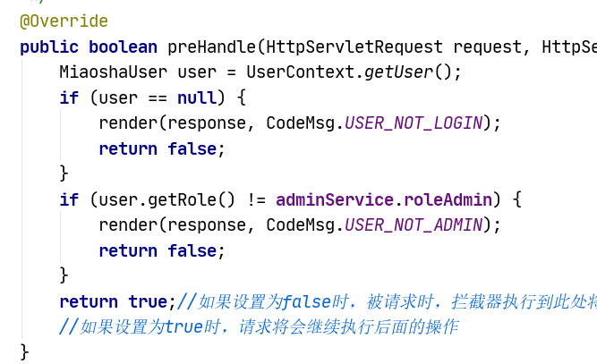

使用此方法配置之后再使用自定义拦截器时跨域相关配置就会失效。
原因是请求经过的先后顺序问题，当请求到来时会先进入拦截器中，而不是进入Mapping映射中，所以返回的头信息中并没有配置的跨域信息。浏览器就会报跨域异常。

正确的解决跨域问题的方法时使用CorsFilter过滤器。代码如下↓，但是之前设置的跨域配置却失效了，自定义跨域配置在`WebConfig.java`下

```java
@Bean
public CorsFilter corsFilter() {
    CorsConfiguration config = new CorsConfiguration();
    // 设置允许跨域请求的域名
    config.addAllowedOrigin(frontHost);
    // 是否允许证书 不再默认开启
    // config.setAllowCredentials(true);
    // 设置允许的方法 * 为所有
    config.addAllowedMethod("*");
    // 允许任何头
    config.addAllowedHeader("*");
    //config.addExposedHeader("token");
    config.setMaxAge(3600L);
    UrlBasedCorsConfigurationSource configSource = new UrlBasedCorsConfigurationSource();
    configSource.registerCorsConfiguration("/**", config);
    return new CorsFilter(configSource);
}
```

### 添加订单鉴权

访问订单是否为同一用户，不是则返回订单不存在(管理员例外)

```java
if (!orderInfo.getUserId().equals(user.getId())) {
    if (user.getRole() != AdminService.roleAdmin) {
        return Result.error(CodeMsg.ORDER_DATAILNOFOUND);
    }
}
```

### 设置数据库miaosha_goods

设置数据库秒杀商品表插入使用默认当前时间，这样只 插入一个ID便会自动生成一条数据

```mysql
ALTER TABLE `miaosha`.`miaosha_goods` 
MODIFY COLUMN `start_date` timestamp(0) NULL DEFAULT CURRENT_TIMESTAMP ON UPDATE CURRENT_TIMESTAMP(0) COMMENT '秒杀开始时间' AFTER `stock_count`,
MODIFY COLUMN `end_date` timestamp(0) NULL DEFAULT CURRENT_TIMESTAMP ON UPDATE CURRENT_TIMESTAMP(0) COMMENT '秒杀结束时间' AFTER `start_date`;
# 或者
ALTER TABLE `miaosha`.`miaosha_goods` 
MODIFY COLUMN `start_date` timestamp(0) NULL DEFAULT CURRENT_TIMESTAMP ON UPDATE CURRENT_TIMESTAMP COMMENT '秒杀开始时间' AFTER `stock_count`,
MODIFY COLUMN `end_date` timestamp(0) NULL DEFAULT CURRENT_TIMESTAMP ON UPDATE CURRENT_TIMESTAMP COMMENT '秒杀结束时间' AFTER `start_date`;
```

### 前端传入日期String无法转换为Date

```java
//添加注解    
//此注解为向前端传参@JsonFormat(pattern = "yyyy-MM-dd HH:mm:ss", timezone = "GMT+8")
@DateTimeFormat(pattern = "yyyy-MM-dd HH:mm:ss")
private Date endDate;
```

### 传参无法接收问题

#### 接收参数两种形式

表单数据和json字符串（Form Data和Request Payload）

- Form Data 后端接受参数代码 `@Valid LoginVo loginVo`

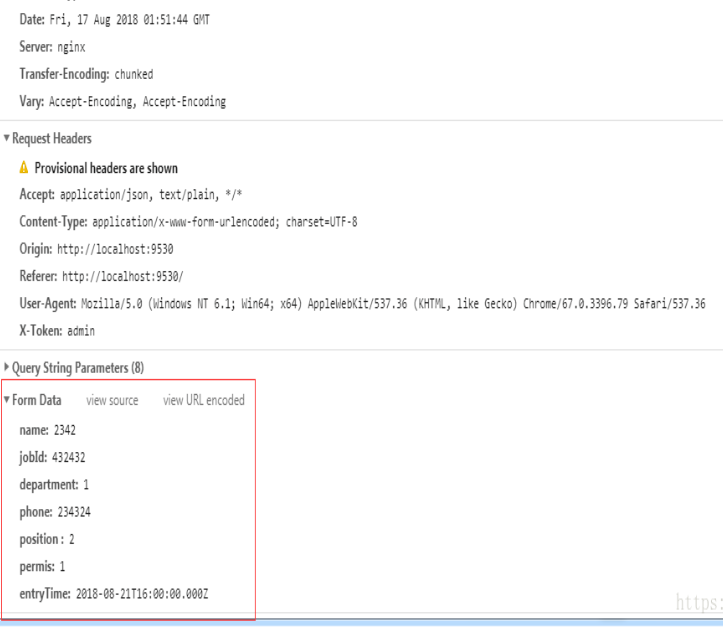

- Json字符串

    后端接受 参数代码 `@RequestBody @Validated LoginVo loginVo`

    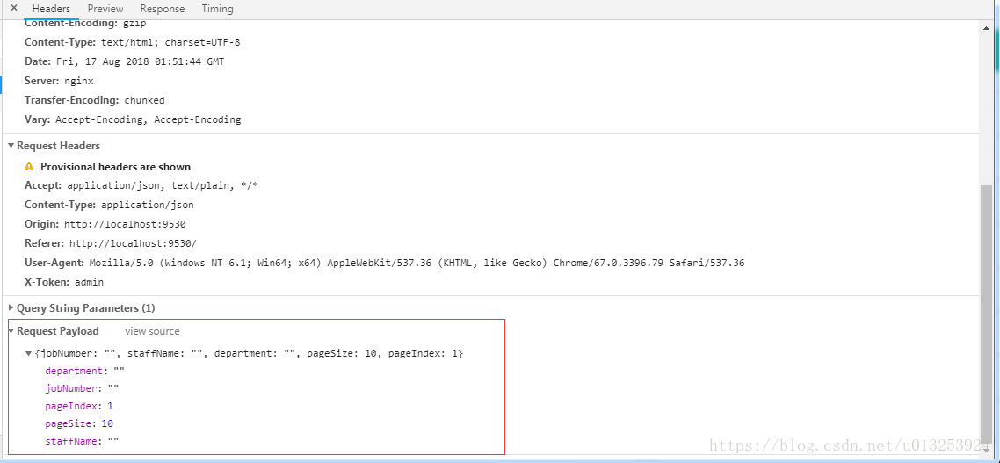

- 示例

    ```java
    @PostMapping("/login")
    @ResponseBody
    public Result<String> login(@RequestBody @Validated LoginVo loginVo, HttpServletResponse response) {
        ...
        return Result.success(token);
    }
    ```

- axios全局设置请求格式为form-data

    ```html
    import axios from 'axios'
    import qs from 'qs'
    
    // 实例对象
    let instance = axios.create({
      timeout: 6000,
      headers: {
        'Content-Type': 'application/x-www-form-urlencoded'
      }
    })
    
    // 请求拦截器
    instance.interceptors.request.use(
      config => {
        config.data = qs.stringify(config.data) // 转为formdata数据格式
        return config
      },
      error => Promise.error(error)
    )
    ```

- 或者

    ```html
    import axios from "axios"  //引入
    
    //设置axios为form-data
    axios.defaults.headers.post['Content-Type'] = 'application/x-www-form-urlencoded';
    axios.defaults.headers.get['Content-Type'] = 'application/x-www-form-urlencoded';
    axios.defaults.transformRequest = [function (data) {
        let ret = ''
        for (let it in data) {
          ret += encodeURIComponent(it) + '=' + encodeURIComponent(data[it]) + '&'
        }
        return ret
    }]
    //然后再修改原型链
    Vue.prototype.$axios = axios
    
    ```

    

### 重复秒杀问题

建立索引保证用户和商品唯一，防止单一用户短时间请求N次多次秒杀到同一商品


# 秒杀常见问题

### 秒杀分析：高并发发生在哪里

数据库访问峰值300-700，受机器影响;缓存一致性的问题，数据库修改后，缓存并没修改，这时就需要实时更新，写到代码里有耦合问题。使用消息队列异步机制去更新缓存数据。单个Tomcat抗压300-500。

首先是详情页，详情页会获取当前商品的数据，并进行计时，执行秒杀操作，返回结果（红色代表可能出现高并发的点，绿色代表无影响）

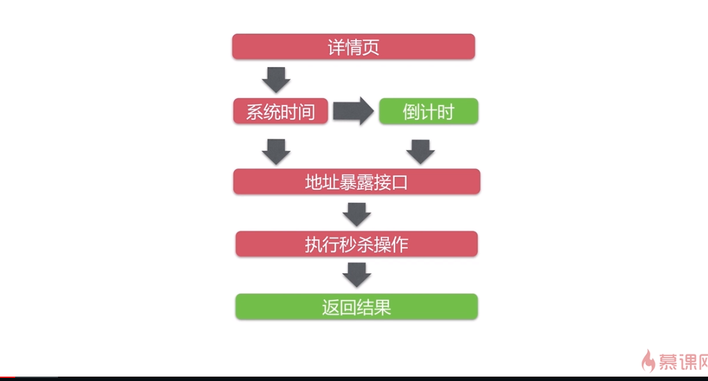


详情页->用户大量刷新->CDN详情页静态化->

CDN(内容分发网络)一般部署到离用户最近的节点上，加速用户获取数据，命中CDN不需要访问后端服务器，前端静态资源部署cdn，动态详情信息使用redis存储，只在初次请求redis中为null时去访问数据库

秒杀-> 无法使用CDN缓存->后端缓存困难->一行数据竞争：热点商品

其他解决方案：原子计数器(redis/NoSQL)-->记录消息行为-->消费消息落地

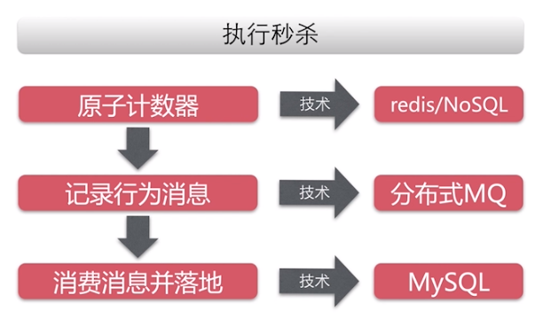

缺点：多服务器部署情况下，幂等性难保证可能出现重复秒杀问题

mysql  update一条数据可以达到4WQPS，影响系统速度的点可能在java控制事务行为上。

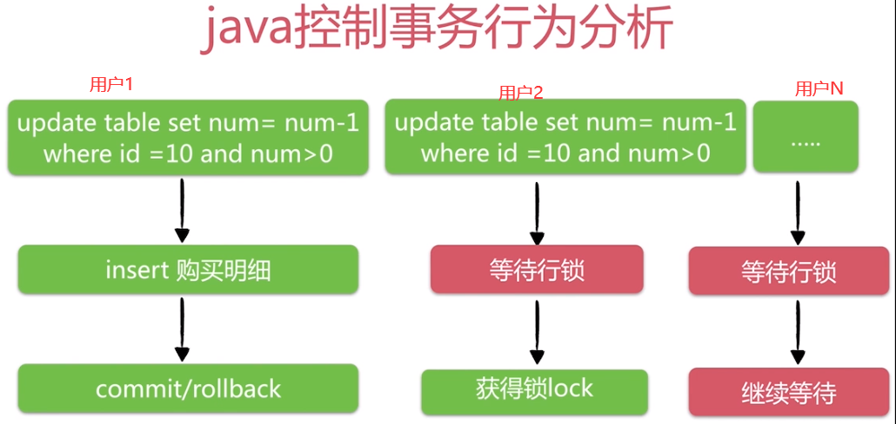

瓶颈分析


优化分析：行级锁在Commit之后释放---》优化方向减少行级锁持有时间

多机部署会有延时问题，JVm与mysql交互存在延时


[如何把秒杀逻辑放到Mysql服务端](#如何把秒杀逻辑放到Mysql服务端)


### 超卖问题

**超卖**：多个进程进入事务，产生共享锁，在update库存的时候，可能会出现查询库存都是大于0的，结果一减库存，出现库存小于0，产生超卖现象

```
在sql加上判断防止数据边为负数 
数据库加唯一索引防止用户重复购买
redis预减库存减少数据库访问　内存标记减少redis访问　请求先入队列缓冲，异步下单，增强用户体验
```

### 前后端分离

尽量前后分离，前端使用CDN做静态缓存

### 对象级缓存redis

```
 redis永久缓存对象减少压力
 redis预减库存减少数据库访
 内存标记方法减少redis访问
```

### 订单处理队列rabbitmq

```
 请求先入队缓冲，异步下单，增强用户体验
 请求出队，生成订单，减少库存
 客户端定时轮询检查是否秒杀成功 
```

### 解决分布式session

```
雪花算法生成随机的uuid作为cookie返回并redis内存写入 
拦截器每次拦截方法，来重新获根据cookie获取对象
下一个页面拿到key重新获取对象
HandlerMethodArgumentResolver 方法 supportsParameter 如果为true 执行 resolveArgument 方法获取miaoshauser对象
如果有缓存的话 这个功能实现起来就和简单，在一个用户访问接口的时候我们把访问次数写到缓存中，在加上一个有效期。
通过拦截器. 做一个注解 @AccessLimit 然后封装这个注解，可以有效的设置每次访问多少次，有效时间是否需要登录！

-- 可以做JWT验证系统，无需存储用户登录状态，过期时间使用cookie管理
```

### 通用缓存key的封装采用什么设计模式

```
模板模式的优点
具体细节步骤实现定义在子类中，子类定义详细处理算法是不会改变算法整体结构
代码复用的基本技术，在数据库设计中尤为重要
存在一种反向的控制结构，通过一个父类调用其子类的操作，通过子类对父类进行扩展增加新的行为，符合“开闭原则”
缺点：　每个不同的实现都需要定义一个子类，会导致类的个数增加，系统更加庞大
```

### redis的库存如何与数据库的库存保持一致

```
redis的数量不是库存,他的作用仅仅只是为了阻挡多余的请求透穿到DB，起到一个保护的作用
因为秒杀的商品有限，比如10个，让1万个请求区访问DB是没有意义的，因为最多也就只能10个
请求下单成功，所有这个是一个伪命题，我们是不需要保持一致的
```

### redis 预减成功，DB扣减库存失败解决方案

```
-其实我们可以不用太在意，对用户而言，秒杀不中是正常现象，秒杀中才是意外，单个用户秒杀中
1.本来就是小概率事件，出现这种情况对于用户而言没有任何影响
2.对于商户而言，本来就是为了活动拉流量人气的，卖不完还可以省一部分费用，但是活动还参与了，也就没有了任何影响
3.对网站而言，最重要的是体验，只要网站不崩溃，对用户而言没有任何影响
```

### Redis序列化解决方案

序列化可以采用字符串方式以json数据存储，也可以使用二进制方式存储，以json存储有利于查看存储的数据，使用二进制方式存储将有更快的速度，以及更节省Redis空间，本次开发采用两种解决方案并存的方式，通过配置文件，可以做到快捷切换

 性能对比测试 https://github.com/eishay/jvm-serializers/wiki

### rabbitmq如何做到消息不重复不丢失即使服务器重启

 - 持久化交换机和队列

 - 持久化消息

     [如何保证RabbitMQ的消息不丢失及其背后的原理](https://www.cnblogs.com/tiancai/p/9627138.html)      https://www.cnblogs.com/tiancai/p/9627138.html

    > **虽然持久化消息可以做到消息的不丢失，但持久化的消息在进入队列前会被写到磁盘，这个过程比写到内存慢得多，所以会严重的影响性能，可能导致消息的吞吐量降低10倍不止。所以，在做消息持久化前，一定要认真考虑性能和需求之间的平衡关系。**

### 为什么threadlocal存储user对象，原理是什么

```html
并发编程中重要的问题就是数据共享，当你在一个线程中改变任意属性时，所有的线程都会因此受到影响，同时会看到第一个线程修改后的值
有时我们希望如此，比如：多个线程增大或减小同一个计数器变量
但是，有时我们希望确保每个线程，只能工作在它自己 的线程实例的拷贝上，同时不会影响其他线程的数据

举例： 举个例子，想象你在开发一个电子商务应用，你需要为每一个控制器处理的顾客请求，生成一个唯一的事务ID，同时将其传到管理器或DAO的业务方法中，以便记录日志。一种方案是将事务ID作为一个参数，传到所有的业务方法中。但这并不是一个好的方案，它会使代码变得冗余。你可以使用ThreadLocal类型的变量解决这个问题。首先在控制器或者任意一个预处理器拦截器中生成一个事务ID然后在ThreadLocal中设置事务ID，最后，不论这个控制器调用什么方法，都能从threadlocal中获取事务ID而且这个应用的控制器可以同时处理多个请求，同时在框架 层面，因为每一个请求都是在一个单独的线程中处理的，所以事务ID对于每一个线程都是唯一的，而且可以从所有线程的执行路径获取运行结果可以看出每个线程都在维护自己的变量：
 Starting Thread: 0 : Fri Sep 21 23:05:34 CST 2018
 Starting Thread: 2 : Fri Sep 21 23:05:34 CST 2018
 Starting Thread: 1 : Fri Jan 02 05:36:17 CST 1970
 Thread Finished: 1 : Fri Jan 02 05:36:17 CST 1970
 Thread Finished: 0 : Fri Sep 21 23:05:34 CST 2018
 Thread Finished: 2 : Fri Sep 21 23:05:34 CST 2018
 
 局部线程通常使用在这样的情况下，当你有一些对象并不满足线程安全，但是你想避免在使用synchronized关键字
 块时产生的同步访问，那么，让每个线程拥有它自己的对象实例
 注意：局部变量是同步或局部线程的一个好的替代，它总是能够保证线程安全。唯一可能限制你这样做的是你的应用设计约束
 所以设计threadlocal存储user不会对对象产生影响，每次进来一个请求都会产生自身的线程变量来存储
```

同时你需要注意的是及时释放被存储的数据，可以在最后的get后加上remove

### redis 分布式锁实现方法

V1---->>版本没有操作，在分布式系统中会造成同一时间，资源浪费而且很容易出现并发问题

V2---->>采用成熟的框架redisson,封装好的方法则可以直接处理，但是waittime记住要这只为0

### sql优化()

都说mysql的效率低，其实并不是。一条update语句1秒可以抗住4W的并发，这其实不算低了；那么效率是丢在了哪里呢？

GC：就是java虚拟机回收垃圾，释放内存的过程。这会终端所用的业务，也就是java代码，大概需要几十毫秒。不是每次操作都会有GC产生，但它一定会发生。

这里还会有一个事务的行级锁的问题，当一个事务在执行时，它会把相关的功能锁住。当它commit或者rollback之后，后面的事务才能继续执行，以次类推，会造成很大的拥堵。

优化的方向：减少行级锁持有的时间。

这里注意一下：如何减少行级锁持有时间

    以秒杀系统为例：先执行insert，后执行update，行级锁持有时间只在update前后；
    若先执行update，在执行insert，那么行级锁的持有时间就变成了update到第二个update之间的update和insert时间，相当于多包含了insert的网络延迟和GC。
    同一事务，先后顺序确实有差异（还挺大）。

   把客户端逻辑放到Mysql服务端，避免网络延迟和GC的影响；

秒杀环节的瓶颈点在对同一商品“竞争”执行 update 操作，数据库对一行数据执行 update操作时，会加上行级锁，此时其他 update 操作处于等待，等事务提交或回滚后释放行级锁，其他 update 操作才能依次执行，而 insert 操作是可以并发运行的，也就是行级锁持有时间阻塞了秒杀进程；Java 与 MySQL 交互，使用 Java 执行 SQL 语句的耗时，包括 SQL 语句执行耗时、发送语句到 MySQL 和返回结果的网络延迟、GC 操作耗时，一次秒杀行为的耗时计算公式为：一次秒杀耗时=update 耗时+insert 耗时+网络延迟+GC 耗时+其他耗时。所有耗时加起来，秒杀行为的总耗时就变长了

因此减少行级锁的持有时间和降低网络延迟即可大幅降低一次秒杀耗时，方法是：①将 insert 调到 up⁃date 之前运行，insert 可以并发执行，若 update 成功，则可以同时提交，否则，则同时回滚，只有 update 需要锁住，性能提升一倍；②将业务逻辑封装成存储过程放在MySQL 服务端运行，Java 客户端只需要拿到执行结果即可，MySQL 本地执行存储过程是很快的，这样大部分网络延迟和 GC 耗时会被消灭掉

- 存储过程

```mysql
-- 秒杀执行存储过程
-- ;分号决定是否换行
DELIMITER $$ -- 新的换行 由 ; 转换为 $$
-- 定义存储过程 in 输入参数 out 输出参数
-- row_count() 返回上一条修改类型sql (delete, insert, update)的影响行数的影响函数
-- row_count() 0表示未修改数据 >0 表示修改的行数 <0表示sql错误/未执行
create procedure `miaosha`.`execute_miaosha`(in v_userId bigint, in v_goodsId bigint,
                                             in v_orderId bigint, out r_result int)
begin
    declare insert_count int default 0;
    start transaction ;
    -- 开始事务
    -- 插入订单
    insert ignore into miaosha_order
        (user_id, goods_id, order_id)
    values (v_userId, v_goodsId, v_orderId);
    select row_count() into insert_count;
    if (insert_count = 0) then -- 未修改
        rollback;
        set r_result = -1; -- 返回重复秒杀
    elseif (insert_count < 0) then -- 没有执行过或者错误
        rollback;
        set r_result = -2; -- 返回系统异常
    else
        update miaosha_goods m,goods g
        set m.stock_count = m.stock_count - 1,
            g.goods_stock = g.goods_stock - 1
        where m.goods_id = g.id
          and m.goods_id = v_goodsId
          and m.stock_count > 0; -- 同时更新两个库存
        select ROW_COUNT() INTO insert_count;
        if (insert_count = 0) then
            rollback;
            SET r_result = 0;
        elseif (insert_count < 0) then
            rollback;
            set r_result = -2;
        else
            commit; -- 提交
            set r_result = 1; -- 返回成功
        end if;
    end if;
end $$
-- 存储过程定义结束

-- 使用
set @r_result = 0;
call execute_miaosha(15588537323, 7921356129305198597, 1008600, @r_result)
select @r_result
```


经过多组测试，对同一行数据执行一次 update 操作，使用存储过程事务的行级锁持有时间大约为 6ms，使用 Java 客户端托管的事务行级锁持有时间大约为40ms，相差 34ms，这意味者如果有 500 人同时竞争同一个热点商品，优化后的事务排队时间可以减少 17s

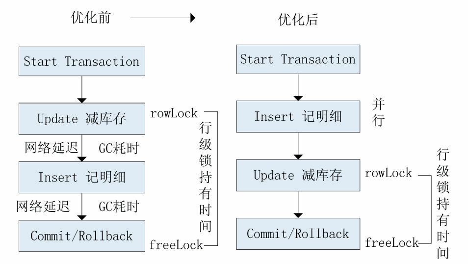


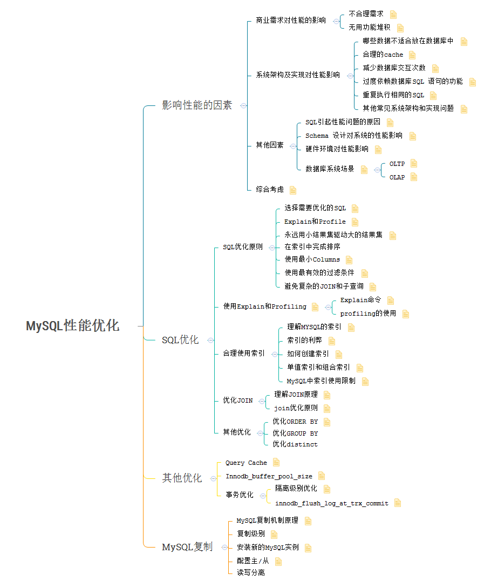

QPS测试，未使用存储过程前，

- 秒杀商品1，秒杀数量10，线程数5000，循环次数3次(此时Tomcat通过调整最大并发量，异常率大幅下降，未出现超卖问题)

- 结果：QPS/1175

QPS测试，使用存储过程后

- 这一措施将大幅减少数据库与jvm交互（由于使用消息队列，测试数据量较少性能提升不明显）

- 压测条件如上 QPS/1368

    

### 需要从服务器请求时间，保证时间一致性吗？

请求详细信息时，会从服务器携带请求剩余时间，根据此时间倒计时，所以不需要从服务器请求时间

### 热点数据Redis击穿，雪崩问题

[Redis缓存击穿，穿透，雪崩等问题，及解决方案](./Redis缓存击穿，穿透，雪崩等问题，及解决方案.md)

```java
//防止缓存雪崩，随机时间存储
this.expireSeconds = expireSeconds + (int) (Math.random() * 11 + 40);
```

###  如果用户不停地查询一条不存在的数据，缓存没有，数据库也没有，那么会出现什么

如果数据不存在，缓存中没有，数据库也没有，当然如果不设置判断，会一直调用数据库，使数据库效率降低，访问量大时甚至会宕机。

解决方案：从数据库查询，如果数据库没有，则返回值为Null，判断数据库返回的值，如果为Null，则自定义把标识的字段存到Redis中，用key,value的方法，jedis.setex(key,"empty")，设置失效时间跟具体情况而定，然后调用String json=jedis.get(key),判断是否获取的值"empty".equal(json),如果相等，则抛出自定义异常，给用户提示，或者直接return null。这样用户再次查询的时候由于先从reids缓存中查询，redis会有对应的Key获取之前设置的value值，这样就不会再次调用数据库，影响效率等问题。

### mybatis查询性能提升

 resultType改用resultMap，大数据查询时性能显著提升

### 基于Tomcat连接的调优

```properties
# 最大线程数
server.tomcat.max-threads=500
# 队列长度
server.tomcat.accept-count=50
# 最大链接数
server.tomcat.max-connections=5000
```

### 如何判断Update更新成功

- 两个条件
    - Update自身没报错
    - 客户端确认Update影响记录数
- 优化思路
    - 把客户端逻辑放到MySQL服务端，避免网络延迟和GC影响

### <span id="如何把秒杀逻辑放到Mysql服务端">如何把秒杀逻辑放到Mysql服务端</span>

两种解决方案:

- 定制SQL方案:update /*+ [auto_ _commit] */，需要修改MySQL源码.
- 使用存储过程:整个事务在MySQL端完成.


系统架构设计在整个系统的开发中起着重要作用，它描述系统要素之间的关系，服务于整个开发过程。好的架构设计可以为开发指明方向，减少开发周期，降低运维成本，有利于后期维护。单体架构有以下几个问题：单体架构的优点:架构单一,容易维护开发、测试、部署都比较便捷，但其缺点也很明显，单体架构的缺点：复杂度高、部署慢，而且体积很大，不利于发布、占用服务器资源过大、不利于热点数据的分割。